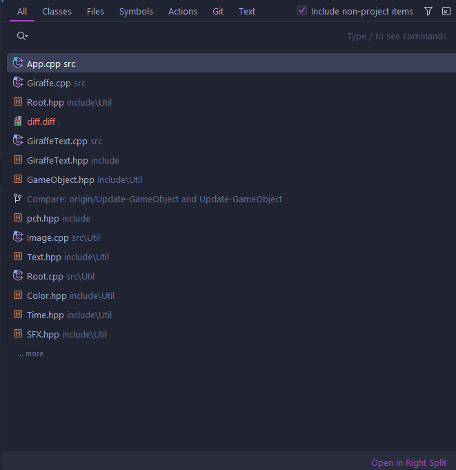

 本著作係採用<a rel="license" href="http://creativecommons.org/licenses/by-nc-sa/4.0/">創用 CC 姓名標示-非商業性-相同方式分享 4.0 國際 授權條款</a>授權。
## 前言

米雪兒(2018)。[Windows] 程式設計教學：選擇 C 或 C++
IDE。檢自[https://opensourcedoc.com/windows-programming/c-or-cpp-ide/](https://opensourcedoc.com/windows-programming/c-or-cpp-ide/)(
July 18, 2023)

上文簡單比較了一些常見的整合開發環境，筆者就不再贅述~~VS 跟 MSVC 有多好用~~以避免宗教戰爭。

這篇文章主要針對 Jetbrains CLion(以下簡稱CLion)做介紹，但其公司所製作的整合開發環境(除了 Fleet)在界面、操作與擴充元件上大致相同。

有鑑於 Jetbrains(以下簡稱 JB)有相當完整的[使用手冊](https://www.jetbrains.com/clion/learn/)，筆者僅針對~~傳教多年~~
遇過的常見問題撰文。由於省略了許多直覺性操作與多年使用下以成本能的功能，細節煩請各位看官 [RTFM 或 STFW](https://github.com/ryanhanwu/How-To-Ask-Questions-The-Smart-Way#rtfm%E5%92%8Cstfw%E5%A6%82%E4%BD%95%E7%9F%A5%E9%81%93%E4%BD%A0%E5%B7%B2%E5%AE%8C%E5%85%A8%E6%90%9E%E7%A0%B8%E4%BA%86)
。就筆者個人經驗，環境問題在 [StackOverflow](https://stackoverflow.com/) 或是其他論壇上十之八九都有人問過了，然而在此也歡迎各位提出遇到的問題與小弟一同討論。

### 內文使用中英對照：

* 整合開發環境：IDE(Integrated Development Environment)
* 擴充元件：Plugin
* 建構：Build
* 執行：Run
* 除錯：Debug
* 覆蓋率：Coverage

## 安裝

JB
底下的整合開發環境分為兩種安裝方式[獨立安裝](https://hackmd.io/FNdnGXTgSyOsjZk0XSEIzA?both#%E7%8D%A8%E7%AB%8B%E5%AE%89%E8%A3%9D)
與[使用 JB Toolbox 安裝](https://hackmd.io/FNdnGXTgSyOsjZk0XSEIzA?both#%E4%BD%BF%E7%94%A8-JB-Toolbox-%E5%AE%89%E8%A3%9D)
，在下載與安裝的過程可以先往下看[取得權限](https://hackmd.io/FNdnGXTgSyOsjZk0XSEIzA?both#%E5%8F%96%E5%BE%97%E4%BD%BF%E7%94%A8%E6%AC%8A%E9%99%90)
的教學。

### 獨立安裝

適合只想嘗試看看的使用者。

* [官網](https://www.jetbrains.com/clion/)
* [Aur](https://aur.archlinux.org/packages/clion) ，不推薦，Aur 底下的 JB IDE 有些 Java 參數要而外調整。筆者建議使用
  Toolbox(見下)。

### 使用 JB Toolbox 安裝

適合 JB 全家桶使用者與電腦裡會有多個專案的使用者(預設下，開啟整合開發環境時會自動進入最後一份專案。Toolbox
可以選擇目標專案以避免浪費換專案的開啟時間)。  

* [官網](https://www.jetbrains.com/toolbox-app/)
* [Aur](https://aur.archlinux.org/packages/jetbrains-toolbox)

## 取得使用權限

JB 旗下的整合開發環境大部分為商業軟體，在未授權下僅能使用 30 天。這時候就要善用軟體界對於教育領域優待了，就像是微軟的
Office 軟體一樣，JB 也提供了教育用途的使用授權。只要到[這裡](https://www.jetbrains.com/community/education/#students)
填寫好資料(或是直接連結已獲得學生包的 Github 帳號)就能開始使用了。

完成手續後[授權頁面](https://account.jetbrains.com/licenses)
會顯示此帳號取得了學生產品包，能使用以下軟體！

### 推薦擴充元件(Plugins)

以下為筆者習慣安裝的擴充元件。老話一句：「第三方軟體使用上有一定風險，安裝前請自行評估風險」：

* [Material Theme UI Lite](https://plugins.jetbrains.com/plugin/12124-material-theme-ui-lite)：除了原生的淺色、灰色與深色外提供更多主題
* [CMD Support](https://plugins.jetbrains.com/plugin/5834-cmd-support)：支援標示 .cmd 檔案的語法。
* [Discord Integration](https://plugins.jetbrains.com/plugin/10233-discord-integration)：支援 Discord rich presence
  讓你的朋友們知道你又在爆肝了。
* [DiscordBeam](https://plugins.jetbrains.com/plugin/12804-discordbeam) ~~共產程式碼好夥伴~~：把程式碼分享到 Discord
  文字頻道，能選擇上傳至 Github gist 並分享連結或是直接以檔案上傳。
* [Github Copilot](https://plugins.jetbrains.com/plugin/17718-github-copilot)：利用 Github 上大量程式碼輔助撰寫程式碼，需有
  Github Copilot [授權](https://github.com/settings/copilot)（包含於 Github 學生包）。
* [Key Promoter X](https://plugins.jetbrains.com/plugin/9792-key-promoter-x)：「提醒」你剛剛按的按鈕快速鍵為何。
* [LeetCode Editor](https://plugins.jetbrains.com/plugin/12132-leetcode-editor)：刷題利器。作者為大陸人，不喜者自行斟酌。

### 專案設定

與 Visual Studio 相似，CLion 並不像是 VSCode 一樣會索引資料夾底下所有檔案，他們需要專案管理檔(VS 使用 `.sln` 與 `.vsproj`
作為專案管理檔；CLion 則是使用 [`CMake`](https://cmake.org) 或是 [`Make`](https://en.wikipedia.org/wiki/Makefile)(截至
113.02.29，[官網](https://www.jetbrains.com/help/clion/makefiles-support.html)仍將相關支援視為開發中，建議還是以 `CMake`
為主))。

### 常用快速鍵（預設）

參考圖

* 
    * Shift+F10：建構(build)並執行目標(效果等同於參考圖中右上
    * Shift+F9：建構並除錯目標(效果等同於參考圖中右上
    * Ctrl+F9：建構目標(效果等同於參考圖中右上

* Shift-Shift :快速選單    

